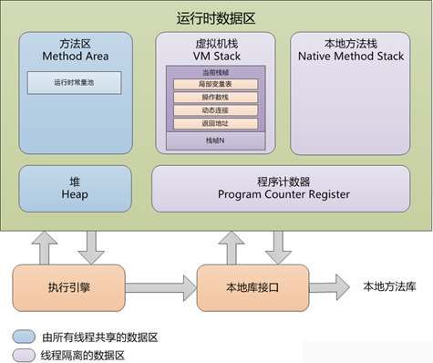

# 深入理解Java虚拟机 #

---

## Chapter 2, Java内存区域、内存溢出异常 ##

### 2.1 概述 ###

> Java与C++之间有一堵由**内存分配**和**垃圾收集**技术所围成的高墙，墙外的人想进来，墙里面的人想出来。

### 2.2 Java运行时数据区 ###

> 

#### 2.2.1 程序计数器 ####

> **程序计数器（Program Counter Register）**是一块儿较小的空间，用来指示当前线程所执行字节码的行号。    
> 字节码解释器工作时就是通过改变这个计数器的值来选定下一条需要执行的字节码指令，分支、循环、跳转、异常处理、线程恢复等基础功能都需要依赖这个计数器来完成。    
> Java虚拟机的多线程是通过线程轮流切换并分配处理器执行时间的方式来实现的，在任一时刻，一个处理器（对于多核处理器来说，就是一个内核）只会执行一条线程中的指令。因此，为了能够恢复线程切换之前的线程状态到正确位置，每条线程都需要有一个独立的程序计数器，各条线程之间互不影响，独立存储，我们称这类内存区域为“线程私有”的内存。    
> 如果线程正在执行的是一个Java方法，这个计数器记录的是正在执行虚拟机字节码指令的地址；如果正在执行的是一个Native方法，这个计数器则是为空（Undefined）。    
> 此内存区域是唯一一个在Java虚拟机规范中没有规定任何OutOfMemoryError情况的区域。    

#### 2.2.2 虚拟机栈 ####

> **Java虚拟机栈（Java Virtual Machine Stack）**也是线程私有的，它的生命周期与线程相同。它描述的是Java方法执行的内存模型：每个方法执行的时候都会同时创建一个栈帧（Stack Frame）用于存储局部变量、操作栈、动态链接、方法出口等信息。    
> *每一个方法被调用直至执行完成的过程，就对应着一个栈帧从虚拟机栈中从入栈到出栈的过程。*        
> 有人把Java内存区分为栈（Stack）和堆（Heap），这是比较粗糙的。实际上，这里的“栈”指的就是现在的这个虚拟机栈，或者确切点说，是虚拟机栈中的局部变量表部分。    
> 局部变量表中存放了编译期可知的基本数据类型（boolean、byte、char、short、int、float、long、double）、对象引用（refrence类型，可能是一个对象起始地址的应用指针、也可能是一个代表对象的句柄或者其它与此对象相关的地址）和returnAddress（指向了一条字节码指令的地址）。   
> 其中，64位长度的long和double类型的数据会占用2个局部变量空间（Slot），其余数据类型会占用一个。局部变量所占用的空间在编译期间完成分配，当进入一个方法时，这个方法在帧中所需要分配的局部变量的空间时完全可以确定的，在运行期间也不会改变这个空间的大小。    
> 如果线程请求的栈的深度大于虚拟机所能允许的深度，会触发StackOverflowError异常；如果虚拟机可以动态地扩展（当前大部分虚拟机都可以扩展，也可以指定固定长度），当扩展无法申请到足够的内存时，会抛出OutOfMemoryError异常。    

#### 2.2.3 本地方法栈 ####

> **本地方法栈（Native Method Stack）**与虚拟机栈的作用非常相似，只不过虚拟机栈是为虚拟机执行字节码（Java方法）服务，而本地方法栈是用来服务于虚拟机使用的Native方法服务。    
> 具体的虚拟机可以自由实现它，甚至可以把它和虚拟机栈合二为一（譬如Sun HotSpot 虚拟机）。    
> 与虚拟机栈一样，本地方法栈也会抛出StackOverflowError和OutOfMemoryErroe异常。    

#### 2.2.4 Java堆 ####

> **Java堆（Java Heap）**是Java虚拟机所管理的内存中最大的一块。是被所有的线程共享的一块内存区域，在虚拟机启动时创建。此内存区域的唯一目的就是存放对象实例，几乎所有的对象实例都在此分配内存。由于JIT编译器的发展与逃逸分析技术的发展，栈上分配、标量替换优化技术的进步，所有的对象实例都分配在堆上也不是那么绝对了。    
> Java堆是垃圾收集器管理的主要区域，因此也被称为“GC堆”（Garbage Collection Heap）。现在的收集器都是采用分代收集算法，所以Java堆中可以细分为：新生代和老生代。
> 根据Java虚拟机规范，Java堆可以是处于物理上不连续的内存空间中，只要逻辑上连续即可。在实现上可以是固定大小，也可以是可扩展的，主流的是可扩展方式。

### 2.2.5 方法区 ###

> **方法区（Method Area）**与Java堆一样，都是各个线程共享的内存区域，它用于存储已被虚拟机加载的类信息、常量、静态常量、即时编译器编译后的代码等数据。
> Java虚拟机规范对这个区域的限制非常松，除了和Java堆一样不需要连续的内存空间和可以选择固定大小或者可扩展外，还可以选择不实现垃圾收集。当方法区的内存大小无法满足内存分配需要的时候，将抛出OutOfMemory异常。

### 2.2.6 运行时常量池 ###

> **运行时常量池（Runtime Constant Pool）**是方法区的一部分。Class文件除了有类的版本、字段、方法、接口等描述信息，还有一项信息就是常量池，用于存放编译时期生成的各种字面量和符号引用，这部分内容将在类加载后存放到方法区的运行时常量池。
> 运行时常量池相对于Class文件常量池的另外一个重要特征是具备动态性，Java语言并不要求常量一定只能在编译期产生，也就是并非预置入Class文件中常量池的内容才能进入方法区运行时常量池，运行期间也可能将将新的常量放入池中，这种特性被开发人员利用的比较多的便是String类的intern()方法。
> 既然运行时常量池是方法区的一部分，自然会受到方法区内存的限制，当常量池无法再申请到内存时将会抛出OutOfMemoryError异常。

### 2.2.7 直接内存 ###

> **直接内存（Direct Memory）**并不是虚拟机运行时数据区的一部分，也不是Java虚拟机规范中定义的内存区域，但是这部分内存也被频繁地使用，而且有可能导致OutOfMemoryError异常。
> 在JDK1.4种新加入了NIO（New Iuput/Output）类，引入了一种基于通道（Channel）与缓冲区（Buffer）的I/O方式，它可以使用Native函数直接分配堆外内存，然后通过一个存储在Java堆里面的DirectByteBuffer对象作为这快内存的引用进行操作。这样能在一些场景中显著提高性能，因为避免了在Java堆和Native堆中来回复制数据。
> 显然，本季直接内存非分配不会收到Java堆大小的限制，但是既然是内存，肯定会受到本机总内存的大小和处理器寻址空间的限制。所以也可能会抛出OutOfMemoryError异常。

### 2.3 对象访问 ###

> 对象访问在Java语言中无处不在，是最普通的程序行为，即使是最简单的访问，也涉及到Java栈、Java堆、方法区这三个重要的内存区域之间的关联关系，如下一句代码：    
> 	```Object obj = new Object();```    
> 假设这句代码出现在方法体中，那"Object obj"这部分的语义将会反映到Java栈的本地变量中，作为一个Reference类型数据出现。
> 而"new Object()"这部分的语义将会反映到Java堆中，形成一块儿存储了Object类型所有实例数据值（Instance Data，对象中各个实例字段的数据）的结构化内存，根据具体类型以及虚拟机实现的对象内存布局（Object Memory Layout）的不同，这块儿内存的大小是不固定的。另外，在Java堆中，还必须包含能包括能查到此对象类型数据（如，对象类型、父类、实现的接口、方法等）的地址信息，这些数据存储在方法区中。
> 由于reference类型在Java虚拟机规范里只规定了一个指向对象的引用，并没有定义这个引用应该通过哪种方式去定位，以及访问到Java堆中的对象的具体位置，应此不同的虚拟机实现的对象访问方式会有所不同，主流的访问方式有两种：使用句柄和直接指针。
> 
- 句柄方式，Java堆中将会划分出一块内存作为句柄池，reference中存储的就是对象的句柄地址，而句柄中包含了对象实例数据和类型数据各自的具体地址信息，如下图：
> 
> 
- 指针方式，reference变量中直接存储的就是对象的地址，而Java堆对象的布局中就必须考虑如何防止访问类型数据的相关信息，如下图：
> 


