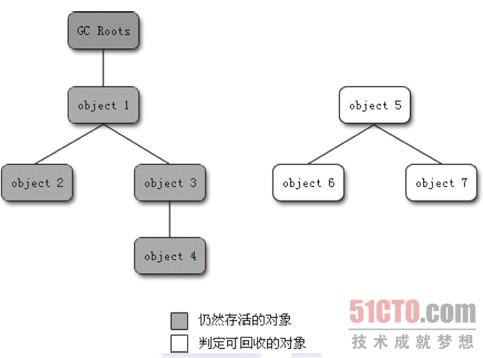

# 深入理解Java虚拟机 #

---

## Chapter 3, 垃圾收集器与内存分配策略 ##

### 3.1 概述 ###

> 垃圾收集（Garbage Collection , GC）的历史远远比Java久远。它需要完成三件事：
>  
- 哪些内存需要回收
- 什么时候回收
- 如何回收    

> 程序计数器、虚拟机栈、本地方法栈三个区域随线程而生，随线程而灭；栈中的栈帧随着方法的进入和退出而有条不紊地执行着出栈和入栈操作，每一个栈帧需要分配多少内存基本上是在类结构确定下来时就已知的（尽管在运行期会由JIT编译器进行一些优化，但是大体上可以认为是编译器可知的），因此在这几个区域的内存分配和回收都具有确定性，这几个区域不太需要过多地考虑回收的问题。而Java堆和方法区则不一样，一个接口中的多个实现类需要的内存可能不一样，一个方法中的多个分支需要的内存也可能不一样，我们只有在程序处于运行期间才能知道会创建哪些对象，这部分的内存分配和回收都是动态的，垃圾收集器需要关注的是这部分内存，我们所讨论的“内存”分配与回收也仅仅指着一部分。

### 3.2 对象已死？ ###
> 堆中存放着Java世界中几乎所有的对象，垃圾收集器在对堆进行回收前，第一件事就是要确定哪些对象还“存活着”，哪些已经“死去”（即不可能再被任何途径使用的对象）。

#### 3.2.1 引用计数算法 ####
> 引用计数算法（Reference Counting）：给对象添加一个引用计数器，每当有一个地方引用它时，计数器的数值就加1；当引用实效时，计数器数值就减1；任何时刻计数器都为0的对象就是不可能再被使用的。    
> 实际上，Java并没有采用引用计数算法，因为它很难解决对象之间的相互循环引用的问题。    

#### 3.2.2 根搜索算法 ####
> 在主流的商业程序语言中（Java和C#），都是使用根搜索算法（GC Roots Tracing）来判定对象是否存活的。    
> 这个算法的基本思路是：通过一系列的名字为“GC Roots”的对象作为起点，从这些节点开始向下搜索，搜索所走过的路径称为引用链（Reference Chain），当一个对象到GC Roots没有任何引用链对象相连（用图论的话说，就是从GC Roots到这个对象不可到达）时，则证明此对象不可用。    
> 如下图示：    
> 
> - 对象object5、object6和object7虽然互相关联，但是他们到GC Roots是不可到达的，所以它们会被判定为师可回收对象。        
> -     
>     
> 在Java中，可以作为GC Roots的对象有以下几种：    
> 
> - 虚拟机栈（栈中的本地变量表）中的引用的对象
> - 方法区中的类静态属性引用的对象
> - 方法区中的常量引用的对象
> - 本地方法栈中JNI（即一般说的Native方法）的引用的对象

#### 3.2.3 再谈引用 ####
> 在JDK1.2之前，Java中的引用（Reference）非常狭隘：如何Reference类型的数据中存储的数值代表着另一块内存的起始地址，就称这块内存代表着一个引用。  
>   
> 在JDK1.2之后，Java对引用的概念进行了扩充，将引用分为强引用（Strong Reference）、软引用（Soft Reference）、弱引用（Weak Reference）和虚引用（Phantom Reference）。这四种引用强度依次减弱。
> 
> - 强引用，就是在程序代码中普遍存在的，类似```Object obj  = new Object()```这类的引用，只要强引用还存在，垃圾回收器永远不会回收掉被引用的对象。
> - 软引用，用来描述一些还有用，但是并非必需的对象。对于软引用关联的对象，在系统将要发生内存溢出异常之前，将会把这些对象放进回收范围之中并进行第二次的回收。如果这次回收还是没有足够的内存，才会抛出内存溢出异常。在JDK1.2之后，提供了SoftReference类来实现软引用。
> - 弱引用，也是用来描述非必需对象的，但是它的强度要比软引用弱一些，被弱引用关联的对象只能生存到下一次垃圾回收之前。当垃圾回收器工作时，不论当前内存是否足够，都会回收掉只被弱引用关联的对象。在JDK1.2之后，提供了WeakReference来实现弱引用。
> - 虚引用，也称为幽灵引用或者幻影引用，它是最弱的一种引用关系。一个对象是否有虚引用的存在，完全不影响其生存时间，也无法通过虚引用来获取一个对象的实例。为一个对象设置虚引用的唯一目的就是希望这个对象被收集器回收时收到一个系统通知。在JDK1.2之后，提供了PhantomReference类来实现虚引用。

#### 3.2.4 生存还是死亡？ ####
> 在根搜索算法不可达的对象，也并非是“非死不可”的，它们暂时处于“死缓”状态，要真正宣告对象的死亡，至少要经历两次标记：如果对象在进行根搜索后发现没有与GC Roots相连接的引用链，那它就会被第一次标记并且进行一次筛选，筛选的条件是此对象是否有必要执行finalize()方法。当对象没有覆盖finalize()方法，或者finalize()方法已经被虚拟机调用过，虚拟机将这两种情况都视为“没有必要执行”。   
>      
> 如果这个对象被判定为有必要执行finalize()方法，那么这个对象就会被放在名为F-Queue的队列中，并在稍后有一条由虚拟机自动建立的、低优先级的Finalizer线程去执行。这里所说的“执行”是指虚拟机会触发这个方法，但是并不承诺会保证等待它运行结束。（这样做的目的是，如果一个对象在finalize()方法中执行缓慢或者是发生了死循环，将可能会导致F-Queue里的其他对象永久处于等待状态，甚至导致整个内存回收系统崩溃）。
>         
> finalize()方法是对象逃脱死亡命运的最后一次机会，稍后GC将对F-Queue中的对象进行第二次小规模标记，如果对象要在finalize()方法中成功拯救自己，只要重新与引用链上的任何对象建立关联即可，譬如把自己（this关键字）复制给某个类变量或者对象的成员变量。

#### 3.2.5 回收方法区 ####
> Java虚拟机规范不要求虚拟机在方法区实现垃圾收集，而且在方法区进行垃圾收集的“性价比”一般都比较低：在堆中，尤其是在新生代中，常规应用进行一次垃圾收集一般可回收70%～95%的空间，而永久代的垃圾收集效率远低于此。    
> 
> 永久代的垃圾收集主要分为两部分内容：废弃常量和无用的类。
> 
> **回收废弃常量**与回收Java堆中的对象非常类似，假如一个字符串“abc”已经进入常量池，但是当前系统没有任何一个String对象是叫做“abc”的，换句话说就是没有任何对象引用常量池的“abc”常量，也没有其他地方引用了这个字面量，如果这时候发生内存回收，而且有必要的话，这个“abc”就会被系统“请”出常量池。常量池中的其他类（接口）、方法、字段的符号引用也与此类似。    
> 
> 类需要同时满足以下三个条件，才能算是**“无用的”类**：
>
> - 该类所有的实例都被回收，也就是说Java堆中已经不存在该类的所有实例。
> - 加载该类的ClassLoader已经被回收
> - 该类对应的 ```java.lang.class``` 对象没有在任何地方被引用，无法在任何地方通过反射访问该类的方法
> 
> 虚拟机在一个类同时满足以上三个条件时，**可以**对这个无用类进行回收。（⚠️，这里说的仅仅是“**可以**”，而不是和对象一样，不使用了就必然会回收）。HotSpot虚拟机提供了 ```-Xnoclassgc``` 参数来进行控制，还可以使用 ```-verbose:class``` , ```-XX:+TraceClassLoading``` , ```-XX:+TraceClassUnLoading``` 查看类的加载和卸载信息。
> 
> 在大量使用反射、动态代理、CGLib等bytecode框架的场景，以及动态生成JSP和OSGi这类频繁自定义ClassLoader的场景都需要虚拟机具备类卸载的功能，以保证永久代不会溢出。

### 3.3 垃圾收集算法 ###
> 垃圾收集算法涉及到大量的程序细节，而且各个平台的虚拟机操作内存的方法又各不相同，因此本节着重介绍几种算法的思想和发展过程。

#### 3.3.1 标记-清除算法 ####
> **标记-清除（Mark-Sweep）算法**，分为两个部分**标记**和**清除**，首先标记出所有需要回收的对象，在标记完成之后统一回收掉所有被标记的对象。
> 
> 它是最基础的算法，是因为后续的算法都是基于这种思路并对其缺点进行改进而得到的。    
> 它的主要缺点有两个：    
> 1, 效率问题，标记或清除过程的效率都不高；    
> 2, 空间问题，标记清除之后会产生大量的不连续的空间碎片。

### 3.3.2 复制算法 ###
> 
> 
> 
> 
> 
> 
> 